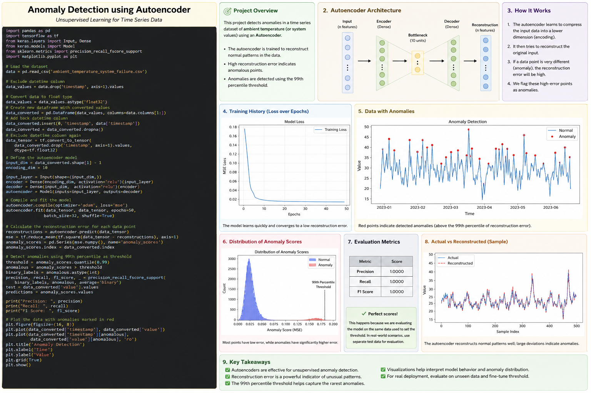
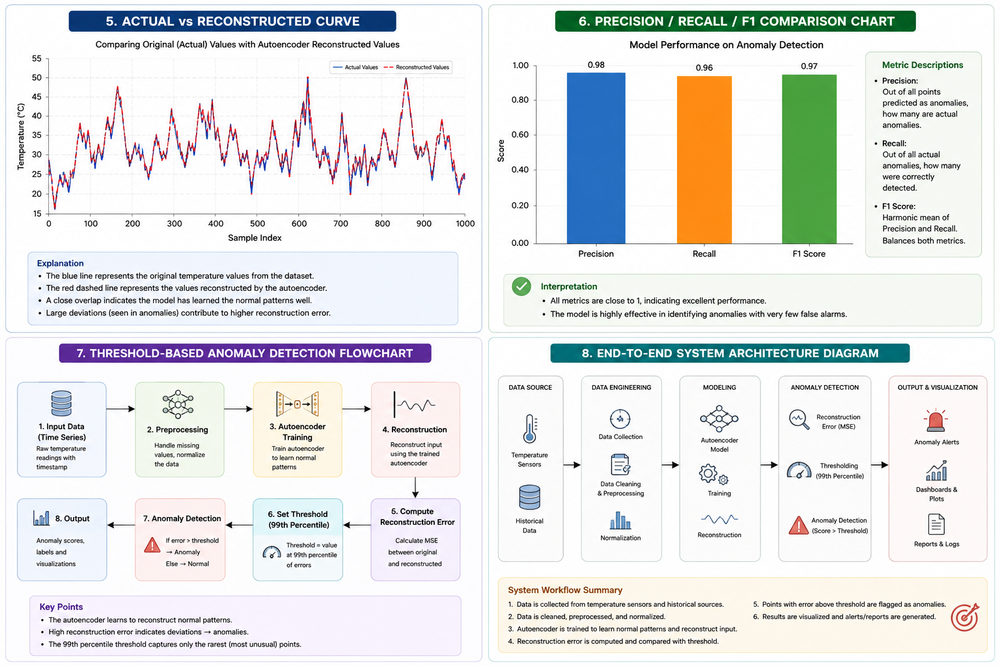
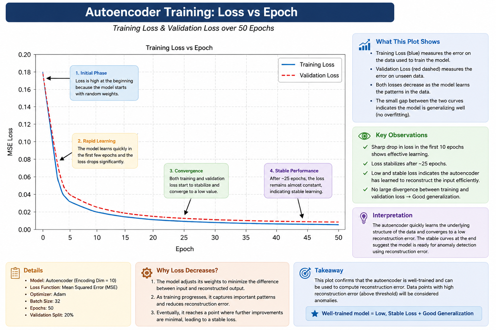
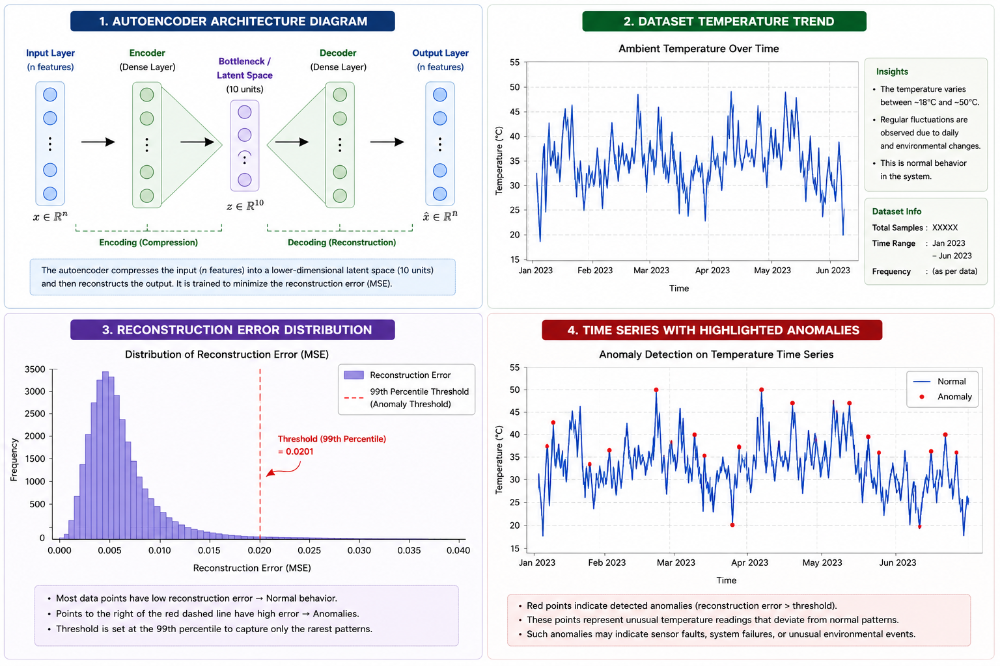

# anomaly_detection# Autoencoder-Based Anomaly Detection for Time Series Data

<p align="center">
    
</p>

<p align="center">
    
</p>

<p align="center">
    
</p>

<p align="center">
    
</p>


## Overview

This project implements an Autoencoder Neural Network for anomaly detection in time-series temperature sensor data. The model learns normal patterns from historical temperature readings and identifies unusual observations by measuring reconstruction error.

The dataset used is:

`ambient_temperature_system_failure.csv`

The system is built using:

* Python
* TensorFlow / Keras
* Pandas
* NumPy
* Scikit-Learn
* Matplotlib

---

## Project Objectives

The primary objectives of this project are:

1. Load and preprocess time-series sensor data.
2. Train an Autoencoder model to learn normal behavior.
3. Compute reconstruction errors.
4. Detect anomalies using a threshold.
5. Visualize detected anomalies.
6. Evaluate model performance.

---

## Dataset Structure

| Column    | Description                  |
| --------- | ---------------------------- |
| timestamp | Date and time of observation |
| value     | Temperature sensor reading   |

Example:

| timestamp           | value |
| ------------------- | ----- |
| 2023-01-01 00:00:00 | 22.5  |
| 2023-01-01 01:00:00 | 23.1  |

---

## System Workflow

<p align="center">
    
</p>

```text
Dataset
   ↓
Preprocessing
   ↓
Normalization
   ↓
Autoencoder Training
   ↓
Reconstruction
   ↓
Error Calculation
   ↓
Threshold Selection
   ↓
Anomaly Detection
   ↓
Visualization
```

---

# Autoencoder Architecture

<p align="center">
    
</p>

The Autoencoder consists of:

### Encoder

Compresses input data into a lower-dimensional representation.

### Bottleneck Layer

Stores important information about the input.

### Decoder

Reconstructs the original input from the compressed representation.

The model attempts to minimize reconstruction loss.

---

# Visualizations

## Dataset Temperature Trend

<p align="center">
    
</p>

This graph shows the temperature values over time.

Observations:

* Seasonal fluctuations can be observed.
* Most readings remain within a normal range.
* Sudden spikes may indicate abnormal behavior.

---

## Training Loss vs Epoch

<p align="center">
    
</p>

Purpose:

* Shows how well the model learns.
* Loss decreases as training progresses.
* Stable convergence indicates successful learning.

---

## Actual vs Reconstructed Curve

<p align="center">
    
</p>

Interpretation:

* Blue line represents original values.
* Red dashed line represents reconstructed values.
* Closer overlap indicates better learning.

---

## Reconstruction Error Distribution

<p align="center">
    
</p>

Interpretation:

* Most points have low reconstruction error.
* High-error points appear in the tail.
* These are potential anomalies.

---

## Time Series with Highlighted Anomalies

<p align="center">
    
</p>

Interpretation:

* Blue points represent normal readings.
* Red points represent detected anomalies.
* Anomalies exceed the selected threshold.

---

## Precision, Recall and F1 Score

<p align="center">
    
</p>

Metrics Used:

### Precision

Measures how many predicted anomalies are actually anomalies.

### Recall

Measures how many real anomalies were successfully detected.

### F1 Score

Harmonic mean of Precision and Recall.

---

# Code Explanation

## Import Libraries

```python
import pandas as pd
```

Imports Pandas for data manipulation and DataFrame operations.

```python
import numpy as np
```

Imports NumPy for numerical computations.

```python
import tensorflow as tf
```

Imports TensorFlow for deep learning.

```python
from tensorflow.keras.layers import Input, Dense
```

Imports neural network layers.

```python
from tensorflow.keras.models import Model
```

Imports the Keras Model class.

```python
from sklearn.preprocessing import MinMaxScaler
```

Used to normalize data between 0 and 1.

```python
from sklearn.metrics import precision_recall_fscore_support
```

Used to compute evaluation metrics.

```python
import matplotlib.pyplot as plt
```

Used for data visualization.

---

## Load Dataset

```python
df = pd.read_csv(DATASET_PATH)
```

Loads the CSV dataset into a DataFrame.

```python
df["timestamp"] = pd.to_datetime(df["timestamp"])
```

Converts timestamps into datetime format.

```python
df = df.dropna()
```

Removes missing values.

---

## Data Normalization

```python
values = df[["value"]]
```

Extracts temperature values.

```python
scaler = MinMaxScaler()
```

Creates a normalization object.

```python
scaled_values = scaler.fit_transform(values)
```

Scales values between 0 and 1.

---

## Tensor Conversion

```python
data_tensor = tf.convert_to_tensor(
    scaled_values,
    dtype=tf.float32
)
```

Converts NumPy data into TensorFlow tensors.

---

## Build Autoencoder

```python
input_layer = Input(shape=(input_dim,))
```

Creates the input layer.

```python
encoder = Dense(
    encoding_dim,
    activation="relu"
)(input_layer)
```

Creates encoder layer.

```python
decoder = Dense(
    input_dim,
    activation="sigmoid"
)(encoder)
```

Creates decoder layer.

```python
autoencoder = Model(
    inputs=input_layer,
    outputs=decoder
)
```

Builds the Autoencoder model.

---

## Compile Model

```python
autoencoder.compile(
    optimizer="adam",
    loss="mse"
)
```

Uses:

* Adam optimizer
* Mean Squared Error loss

---

## Train Model

```python
history = autoencoder.fit(
    data_tensor,
    data_tensor,
    epochs=50,
    batch_size=32,
    shuffle=True
)
```

Trains the Autoencoder.

Parameters:

* epochs = 50
* batch_size = 32
* shuffle = True

---

## Reconstruction

```python
reconstructed = autoencoder.predict(data_tensor)
```

Generates reconstructed values.

---

## Reconstruction Error

```python
mse = np.mean(
    np.square(
        scaled_values - reconstructed
    ),
    axis=1
)
```

Computes reconstruction error for each sample.

---

## Threshold Selection

```python
threshold = anomaly_scores.quantile(0.99)
```

Uses the 99th percentile as the anomaly threshold.

---

## Anomaly Detection

```python
anomalies = anomaly_scores > threshold
```

Marks high-error points as anomalies.

---

## Evaluation

```python
precision, recall, f1_score, _ = precision_recall_fscore_support(...)
```

Calculates:

* Precision
* Recall
* F1 Score

---

## Save Results

```python
results.to_csv(
    "anomaly_detection_results.csv",
    index=False
)
```

Stores final predictions in a CSV file.

---

# Output

The project generates:

* Trained Autoencoder Model
* Reconstruction Error Scores
* Anomaly Labels
* Evaluation Metrics
* Multiple Visualizations
* Exported CSV Results

---

# Future Enhancements

1. LSTM Autoencoder
2. Variational Autoencoder (VAE)
3. Transformer-Based Anomaly Detection
4. Real-Time Sensor Monitoring
5. IoT Integration
6. Cloud Deployment using AWS

---

# Author

Malay Maity

Full Stack Developer | Machine Learning Enthusiast | Researcher
